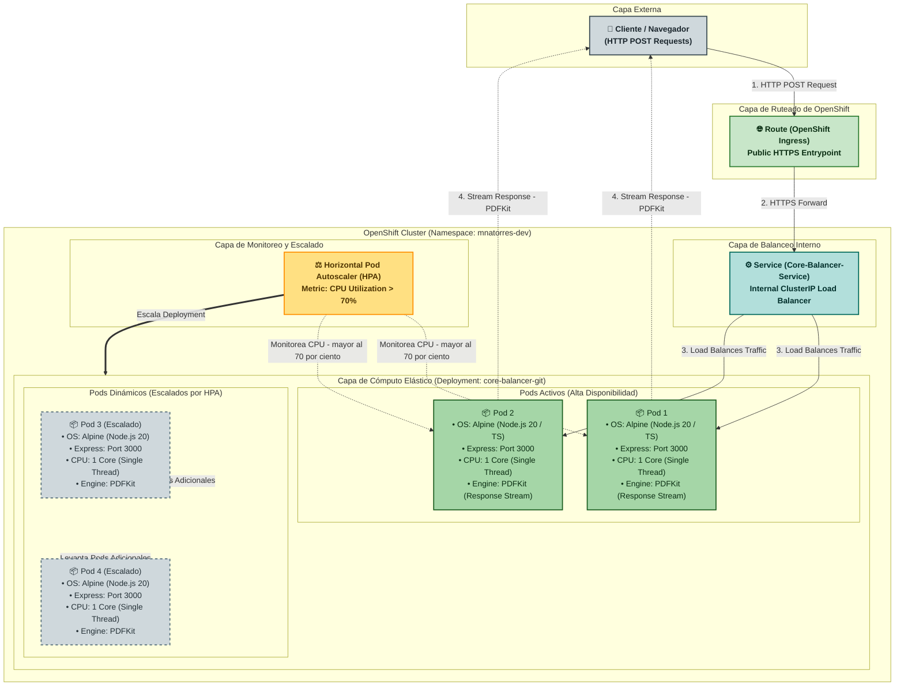
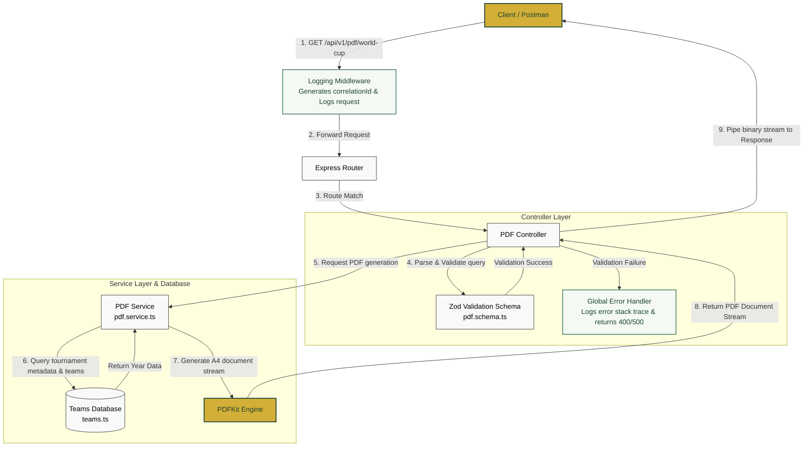

# ⚽ World Cup PDF Generator Microservice

A modern, high-performance, and beautifully designed Node.js microservice written in **TypeScript** that generates and returns dynamically compiled PDF documents containing FIFA World Cup participating teams and statistics.

---

## 📐 Infrastructure & Application Architecture

### 🏗️ OpenShift Infrastructure Architecture

This diagram details the high-availability infrastructure deployed on Red Hat OpenShift, outlining the ingress, load balancing, compute pod configurations, and the dynamic scaling behavior managed by the Horizontal Pod Autoscaler (HPA).



---

### 🔄 Internal Request Flow

This diagram illustrates the internal processing logic of requests within the microservice codebase:



---

## 🚀 Features

- **Layered Architecture**: Clean separation of concerns (Routes → Controllers → Services → Data).
- **Interactive PDF Generation**: Custom-designed 2-page A4 PDF documents built dynamically using `pdfkit`. Includes color themes, grid-based layouts for group stages, and tournament statistics cards.
- **Robust Schema Validation**: Request queries are strictly validated using `zod`.
- **Environment Management**: Port configuration validated using Zod at startup.
- **Correlation ID & Pino Interceptor**: Injects a unique `correlationId` into every request/response (via header `X-Correlation-Id`) and logs request entry and completion (including process duration in `ms`) using `pino`.
- **Global Error Logging**: Catches exceptions in a centralized error middleware, logging them with their stack trace and correlation ID in structured format.
- **Modern ESLint Flat Config**: Clean codebase with TypeScript linting rules.
- **Native Unit Testing**: Utilizes Node's native test runner (`node:test`) for lightweight, zero-dependency testing.
- **CI/CD Integration**: Pre-configured GitHub Actions workflow running tests, linting, and build steps across multiple Node.js versions.

---

## 🛠 Tech Stack

- **Runtime**: Node.js (v18+)
- **Language**: TypeScript
- **Framework**: Express
- **PDF Engine**: PDFKit
- **Validation**: Zod
- **Logging**: Pino & Pino-Pretty
- **Linter**: ESLint (v9)
- **Test Runner**: Node's Native Test Runner + Assert

---

## 📂 Directory Structure

```
core_balancer/
├── .github/
│   └── workflows/
│       └── ci.yml             # GitHub Actions CI pipeline
├── src/
│   ├── config/
│   │   ├── env.ts             # Zod environment variable validation
│   │   └── logger.ts          # Pino logger setup (custom formats, timestamp, level)
│   ├── controllers/
│   │   └── pdf.controller.ts  # Endpoint handlers (orchestrates request & response)
│   ├── data/
│   │   └── teams.ts           # Mock database representing World Cup data
│   ├── middlewares/
│   │   ├── error.middleware.ts   # Centralized error logger & handler with correlationId
│   │   └── logging.middleware.ts # Request/Response interceptor mapping correlationId & ms
│   ├── routes/
│   │   └── pdf.routes.ts      # Express routes declaration
│   ├── schemas/
│   │   ├── pdf.schema.ts      # Zod validation schema for request query params
│   │   └── pdf.schema.test.ts # Native Unit Tests for the query validation schema
│   ├── services/
│   │   └── pdf.service.ts     # Business logic & design layout rendering (PDFKit)
│   ├── types/
│   │   └── request.ts         # Type definitions extending Express.Request
│   ├── app.ts                 # Express middlewares & router setup
│   └── index.ts               # Entrypoint (starts server on port)
├── .env                       # Local environment variables
├── .env.example               # Template environment configuration
├── .gitignore                 # Excludes system, build, logs, and temp PDFs
├── eslint.config.js           # ESLint Flat Config rules
├── package.json               # Dependencies and scripts
└── tsconfig.json              # TypeScript compilation rules (module: Node16)
```

---

## ⚙️ Getting Started

### 1. Installation
Clone the repository, navigate to the folder, and run:
```bash
npm install
```

### 2. Configure Environment
Create a `.env` file from the template:
```bash
cp .env.example .env
```
Inside `.env`, you can adjust the port:
```env
PORT=3000
NODE_ENV=development
```

### 3. Execution Commands
- **Development Mode** (Runs with auto-reload via `ts-node-dev`):
  ```bash
  npm run dev
  ```
- **Production Build** (Compiles TS to JavaScript in `dist/`):
  ```bash
  npm run build
  ```
- **Start Production Server** (Runs the compiled output in `dist/`):
  ```bash
  npm run start
  ```

### 4. Code Quality & Testing
- **Run ESLint**:
  ```bash
  npm run lint
  ```
- **Run Unit Tests**:
  ```bash
  npm run test
  ```

---

## 📡 API Reference

### 1. Healthcheck
Verify that the service is running and healthy.

- **Request**: `GET /health`
- **Response** (200 OK):
  ```json
  {
    "status": "ok",
    "service": "world-cup-pdf-generator",
    "timestamp": "2026-06-15T20:50:09.287Z"
  }
  ```

---

### 2. Generate World Cup PDF
Generates and returns an A4 PDF document containing the groups and statistics of the selected World Cup.

- **Request**: `GET /api/v1/pdf/world-cup`
- **Query Parameters**:
  - `year` *(optional, string)*: The year of the World Cup edition to display. Supported editions: `"2018"`, `"2022"`. Defaults to `"2022"`.

#### Successful Response (200 OK)
- **Content-Type**: `application/pdf`
- **Content-Disposition**: `inline; filename="world-cup-2022-teams.pdf"`
- **Response Body**: The compiled binary PDF document stream.

#### Validation Error (400 Bad Request)
If a query parameter is invalid (e.g. `?year=2026` or `?year=abc`), Zod validation fails and returns the following structure:
- **Response Body**:
  ```json
  {
    "status": "error",
    "message": "Invalid request query parameters",
    "errors": {
      "_errors": [],
      "year": {
        "_errors": [
          "Year must be either 2018 or 2022. Other editions are not supported."
        ]
      }
    }
  }
  ```

---

## 🎨 PDF Design & Layout Details

The generated PDF is built to feel premium and professional, following standard design guidelines:
- **Grid Layout**: Shows 8 groups (A to H) formatted in clear, bordered two-column cards per page.
- **Color Theme**: Features a unified sports theme using Forest Green (`#1b4332`), Emerald Accent (`#2d6a4f`), and Gold highlights (`#d4af37`).
- **Typography**: Uses clean, hierarchy-based system with standard PDF fonts (`Helvetica`, `Helvetica-Bold`).
- **Footer**: Includes dynamic page numbers (`Page X of Y`) calculated on the fly across multiple pages.
- **Analytics Card**: Evaluates the database to list the Top Seeded FIFA teams participating in the selected edition, plus quick trivia and generation metadata.
