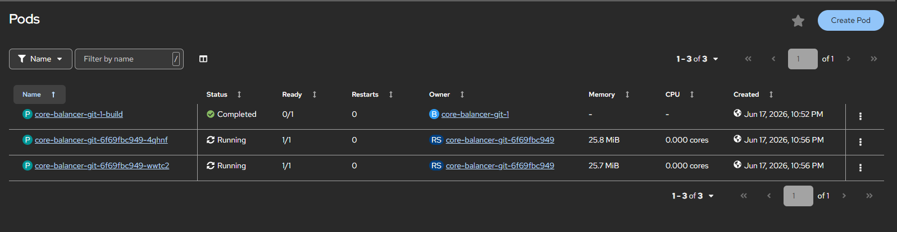
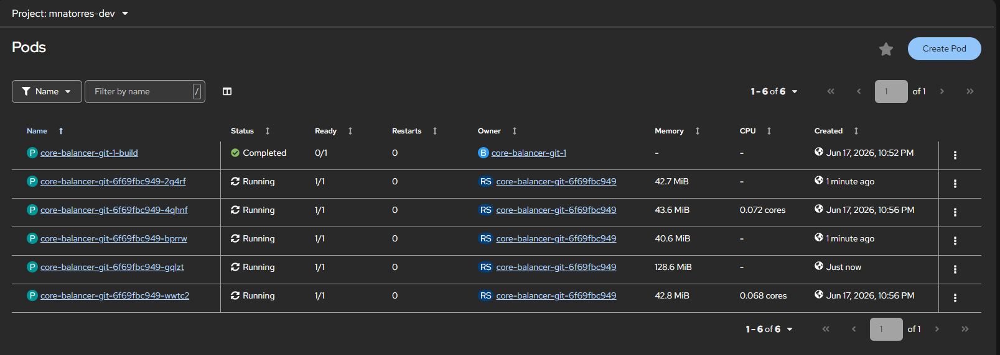

# Core Balancer - Elastic PDF Microservice (Phase 1: Synchronous)

This project serves as a high-availability software architecture laboratory designed to analyze the limitations and behavior of a synchronous communication model under massive processing stress, elastically deployed on **Red Hat OpenShift Sandbox**.

The primary objective is to isolate a computationally intensive (**CPU-bound**) task, package it surgically using single-core containers, and fully delegate resilience and horizontal scaling to the underlying Kubernetes/OpenShift infrastructure using CPU utilization metrics.

---

## 🏗️ Architecture (Elastic Synchronous Model)

The traffic flow implemented within the OpenShift Namespace `mnatorres-dev` follows a linear, synchronous topology managed by the infrastructure:

```mermaid
graph TD
    %% External Client Layer
    subgraph External["External Layer"]
        Client["📱 Client / Autocannon<br/>(HTTP POST / GET Requests)"]
    end

    %% Ingress/Routing Layer
    subgraph IngressLayer["OpenShift Routing Layer"]
        Route["🌐 Route (OpenShift Ingress)<br/>Public HTTPS Entrypoint"]
    end

    %% Kubernetes Cluster / Project Namespace
    subgraph Cluster["OpenShift Cluster (Namespace: mnatorres-dev)"]
        
        subgraph InternalLB["Internal Load Balancing"]
            Service["⚙️ Service (Core-Balancer-Service)<br/>Internal ClusterIP Load Balancer"]
        end

        subgraph Compute["Elastic Compute Layer (Deployment: core-balancer-git)"]
            
            subgraph ActivePods["Active Baseline Pods (High Availability)"]
                Pod1["📦 Pod 1<br/>• OS: Alpine (Node.js 20 / TS)<br/>• Express: Port 3000<br/>• CPU: 1 Core (Single Thread)<br/>• Engine: PDFKit (Response Stream)"]
                Pod2["📦 Pod 2<br/>• OS: Alpine (Node.js 20 / TS)<br/>• Express: Port 3000<br/>• CPU: 1 Core (Single Thread)<br/>• Engine: PDFKit (Response Stream)"]
            end
            
            subgraph ScaledPods["Dynamic Pods (Scaled by HPA)"]
                Pod3["📦 Pod 3 (Scaled)<br/>• OS: Alpine (Node.js 20 / TS)<br/>• Express: Port 3000<br/>• CPU: 1 Core (Single Thread)<br/>• Engine: PDFKit"]
                Pod4["📦 Pod 4 (Scaled)<br/>• OS: Alpine (Node.js 20 / TS)<br/>• Express: Port 3000<br/>• CPU: 1 Core (Single Thread)<br/>• Engine: PDFKit"]
                Pod5["📦 Pod 5 (Scaled)<br/>• OS: Alpine (Node.js 20 / TS)<br/>• Express: Port 3000<br/>• CPU: 1 Core (Single Thread)<br/>• Engine: PDFKit"]
            end
        end

        subgraph ControlPlane["Monitoring & Scaling Layer"]
            HPA["⚖️ Horizontal Pod Autoscaler (HPA)<br/>Metric: CPU Utilization > 70%"]
        end
    end

    %% Traffic Flow Connections
    Client -->|1. HTTP Request| Route
    Route -->|2. HTTPS Forward| Service
    Service -->|3. Load Balances Traffic (Round-Robin)| Pod1
    Service -->|3. Load Balances Traffic (Round-Robin)| Pod2
    
    %% Stream Responses back to Client
    Pod1 -.->|4. Stream Response - PDFKit| Client
    Pod2 -.->|4. Stream Response - PDFKit| Client
    
    %% Scaling & Monitoring Flows
    HPA -.->|Monitors CPU Usage| Pod1
    HPA -.->|Monitors CPU Usage| Pod2
    HPA ==>|5. Scales Deployment| Compute
    Compute -.->|Provisions Additional Pods| Pod3
    Compute -.->|Provisions Additional Pods| Pod4
    Compute -.->|Provisions Additional Pods| Pod5

    %% Styling (dark text for maximum readability, greens and dark grays)
    classDef client fill:#cfd8dc,stroke:#37474f,stroke-width:2px,color:#1a252c,font-weight:bold;
    classDef route fill:#c8e6c9,stroke:#2e7d32,stroke-width:2px,color:#0b2e13,font-weight:bold;
    classDef service fill:#b2dfdb,stroke:#00695c,stroke-width:2px,color:#002f2b,font-weight:bold;
    classDef podActive fill:#a5d6a7,stroke:#1b5e20,stroke-width:2px,color:#0b2e13;
    classDef podScaled fill:#cfd8dc,stroke:#546e7a,stroke-width:2px,color:#263238,stroke-dasharray: 5 5;
    classDef hpa fill:#ffe082,stroke:#ff8f00,stroke-width:2px,color:#4e3400,font-weight:bold;
    
    class Client client;
    class Route route;
    class Service service;
    class Pod1,Pod2 podActive;
    class Pod3,Pod4,Pod5 podScaled;
    class HPA hpa;
```

### Key Infrastructure Components:
*   **Route (Ingress):** The single public entry point exposed to the internet using native HTTPS.
*   **Service (Internal Load Balancer):** A network abstraction that performs Round-Robin load balancing of synchronous connections across active pod replicas.
*   **Traditional Deployment (Anti-Serverless):** We explicitly configured a traditional Kubernetes `Deployment` object to disable scale-to-zero (0 of 0 pods) policies due to inactivity, which are typically enforced by Knative/Serverless in the OpenShift Sandbox. This guarantees baseline availability.
*   **Horizontal Pod Autoscaler (HPA):** The elastic brain of the cluster. It is configured to monitor the CPU usage of the pods and react by scaling up replicas within milliseconds if the average CPU utilization exceeds 70%.

---

## 💻 Microservice Specifications (Software)
*   **Runtime:** Node.js 20 running on Alpine Linux, written natively in TypeScript.
*   **Concurrency Strategy:** One container per core philosophy. We completely removed the use of Node.js's native `cluster` module or process managers like PM2. Each Pod runs a single thread of execution, avoiding context switching overhead and shared resource contention, resulting in 100% granular observability metrics.
*   **Environment Validation:** A strict configuration schema implemented with Zod to validate environment variables injected into the cluster (`PORT=3000`, `NODE_ENV=production`).
*   **Render Engine (CPU-Bound):** Uses PDFKit to process complex iterative loops and conditions (specifically generating a historical World Cup PDF report).
*   **Memory Optimization (Streams):** Leverages data streaming (`doc.pipe(res)`). Binary chunks are piped to the client as they are generated, keeping the Pod's memory footprint optimized and constant (~20 MiB to 43 MiB), thus offloading all stress purely to the CPU.

---

## 🛠️ Advanced Multi-Stage Dockerfile
The production Docker image is optimized using a multi-stage build pattern to keep the final container ultra-lightweight, ensuring fast image pulls and quick deployment times when scaling up:

```dockerfile
# === STAGE 1: Build & Compilation ===
FROM node:20-alpine AS builder
WORKDIR /app
COPY package*.json ./
COPY tsconfig.json ./
# The "--include=dev" flag bypasses the global NODE_ENV=production environment block injected by OpenShift,
# allowing us to temporarily install TypeScript (tsc) and compile the application.
RUN npm install --include=dev
COPY src/ ./src/
RUN npm run build

# === STAGE 2: Production Runtime ===
FROM node:20-alpine AS runner
WORKDIR /app
ENV NODE_ENV=production
ENV PORT=3000
COPY package*.json ./
# Clean installation of production dependencies only (Express, PDFKit, Zod).
RUN npm ci --only=production
COPY --from=builder /app/dist ./dist
EXPOSE 3000
CMD ["node", "dist/index.js"]
```

---

## 🚀 Stress Testing & Autoscaling Validation
To evaluate the elastic behavior of the cluster under compute saturation, we executed a controlled stress test using Autocannon, injecting 20 concurrent connections in a continuous loop for 120 seconds:

```bash
autocannon -c 20 -d 120 "https://core-balancer-git-mnatorres-dev.apps.rm3.7wse.p1.openshiftapps.com/api/v1/pdf/world-cup?year=2022"
```

### Pod Behavior & Scaling Lifecycle:

We monitored the OpenShift cluster during the stress test to analyze how the HPA responds under load. The screenshots below demonstrate the two distinct states of the application.

#### 1. Baseline State (Resting Pods)
In its natural, idle state, the service runs exactly **2 pod replicas**, which is the configured `minReplicas` threshold. In this state, CPU utilization is virtually 0%, and memory usage remains at a baseline.


*Figure 1: The cluster in its idle state, running the configured minimum of 2 pods.*

#### 2. Stressed State (Scaling Pods)
Upon running the Autocannon command, the single-threaded Node.js event loops of the two baseline pods immediately spiked, quickly exceeding the HPA's 70% CPU utilization limit. 

Within seconds, the HPA automatically scaled the deployment to its maximum threshold of **5 pod replicas** to handle the influx of requests.


*Figure 2: Active scaling showing the cluster handling the stress test by deploying a total of 5 active pods.*

### Experiment Results & Key Findings:
*   **Immediate Saturation:** Since each Pod runs a single Node.js thread with no internal cluster workers, it handles one CPU-bound task at a time. The heavy computations required for PDF rendering caused the event loop to saturate instantly, triggering the HPA.
*   **HPA Responsiveness:** The Kubernetes/OpenShift HPA reacted within seconds, proving that resource scaling can be successfully delegated entirely to the infrastructure without bloating the application codebase with process-management logic.
*   **The Synchronous Bottleneck (Critical Finding):** While the system scaled successfully, the communication channel remained strictly synchronous (HTTP). Client connections were held open, accumulating response latency and queueing network overhead while the new pods underwent health checks and initialized. In a production scenario, this introduces high risk of timeouts at the API Gateway or Ingress level.

---

## 🏁 Future Milestone (Phase 2: Event-Driven Architecture)
Having successfully validated the HPA scaling capabilities, the next step of this laboratory is to migrate towards **Phase 2: Event-Driven Architecture (Asynchronous with Message Broker)**:
*   Deploy a **RabbitMQ** cluster within OpenShift to decouple the HTTP request-response cycle.
*   Transition to an asynchronous queue model using the **Competing Consumers** pattern.
*   Implement `Prefetch=1` and explicit `ACK` confirmations, eliminating web-connection backlogs and ensuring that CPU-heavy tasks do not degrade real-time API responsiveness.
